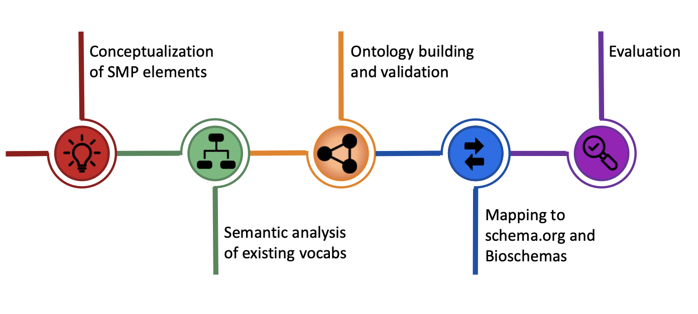

# maSMP Project 

|              |    |    |
:---------------------:|:---------------------:|:---------------------:
  |   | A metadata service in collaboration between [NFDI4DataScience](https://www.nfdi4datascience.de/) and [DMP4NFDI](https://base4nfdi.de/projects/dmp4nfdi)

<table>
<tr>
<td></td>
<td><i>machine-actionable Software Management Plans</i></td>
</tr>
</table>

GitHub repository 

maSMP ontology
   

maSMP profiles
   

## Description

This project corresponds to an extension of the Research Data Alliance (RDA) [machine-actionable Data Management Plan (maDMP)](https://github.com/RDA-DMP-Common/RDA-DMP-Common-Standard) application profile and its corresponding DMP Common Standard ontology (DCSO) in order to cover the case of [ELIXIR Software Management Plans (SMPs)](https://doi.org/10.37044/osf.io/k8znb). Similar to DMPs, SMPs help formalize a set of structures and goals that ensure the software is accessible and reusable in the short, medium and long term. Although targeting the life sciences community, most of the elements of the ELIXIR SMPs are domain agnostic and could be used by other communities as well. DMPs and SMPs can be presented as text-based documents, sometimes guided by a set of questions corresponding to key points related to the lifecycle of either data or software. The RDA DMP Common Standards working group defined a maDMP to overcome limitations of text-based documents. We propose a similar path for the ELIXIR SMPs so they turn into machine-actionable SMPs (maSMPs).

Additional Information available at our [GitHub repository](https://github.com/zbmed-semtec/maSPMs).

Ontology releases are available at [DOI:10.5281/zenodo.7806638](https://doi.org/10.5281/zenodo.7806638) while usage guidance (aka profiles, e.g., minimum, recommended and optional properties with cardinality) at [DOI:10.5281/zenodo.10582120](https://doi.org/10.5281/zenodo.10582120). The current release corresponds to vr.2.1.0 for types and properties and to vr2.1.1 for profiles. This release includes four types: OuputManagementPlan, SoftwareManagementPlan, SoftwareRunAction and SoftwareTestAction, and additional properties for schema:CreativeWork, schema:SoftwareApplication and schema:SoftwareSourceCode. Profiles are provided for: SoftwareManagementPlan, SoftwareRunAction, SoftwareTestAction, schema:SoftwareApplication and schema:SoftwareSourceCode. We have reuse elements from [schema.org](https://schema.org), [Codemeta](http://w3id.org/codemeta) and [Bioschemas](https://bioschemas.org)

[maSMP types](https://discovery.biothings.io/ns/maSMP) and [maSMP profiles](https://discovery.biothings.io/ns/maSMPProfiles) can be visualized in the DDE platform. We also provide embedded pages of the DDE views here, see menu on the left. The corresponding files are in the GitHub repo, [types and properties vr 2.1.0](https://github.com/zbmed-semtec/maSMPs/blob/main/schema/maSMP_schema_v2/maSMP_v2.jsonld), also as [TTL](https://github.com/zbmed-semtec/maSMPs/blob/main/schema/maSMP_schema_v2/maSMP_v2.ttl), and corresponding [profiles vr2.1.1](https://github.com/zbmed-semtec/maSMPs/blob/main/schema/maSMP_schema_v2/maSMP_profiles_v2.jsonld).

## Metadata

You can find schema.org [metadata markup for our maSMP project](https://zbmed-semtec.github.io/projects/2022_maSMP) in our team pages.

## Project Layout

<!--  -->

<!-- 

  

 -->

 
<!-- 

    

 -->

<!-- 

    

 -->
<!-- 
maSMP Timeline
 -->

maSMP Timeline

  
<!--  -->

## Relevant background sources
* [RDA machine-actionable Data Management Plan (maDMP)](https://github.com/RDA-DMP-Common/RDA-DMP-Common-Standard)
* [ELIXIR Software Management Plans (SMPs)](https://doi.org/10.37044/osf.io/k8znb)
* [Practical guide to Software Management Plans](https://zenodo.org/record/7248877#.Y4XeHXaZOUk)
* Crosswalks from [May 2023](https://doi.org/10.5281/zenodo.8087356) and [December 2023](https://doi.org/10.5281/zenodo.10275894)
* [Five Minutes to Write a Software Management Plan – A Machine-actionable Approach to Simplify the Creation of SMPs](https://doi.org/10.5281/zenodo.10374839)

